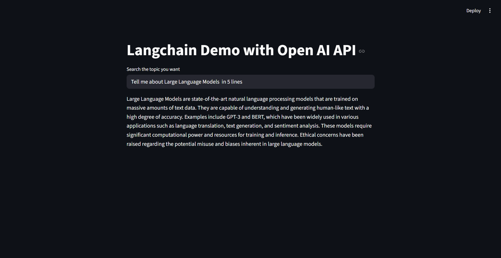

# LangChain OpenAI Demo

A simple Streamlit application that demonstrates how to use LangChain with OpenAI's GPT-3.5-turbo model to create an interactive Q&A chatbot.

## Features

- Simple web interface powered by Streamlit
- Integration with OpenAI's GPT-3.5-turbo model
- LangChain framework for prompt management and output processing
- Real-time question answering

## Prerequisites

- Python 3.7 or higher
- OpenAI API key
